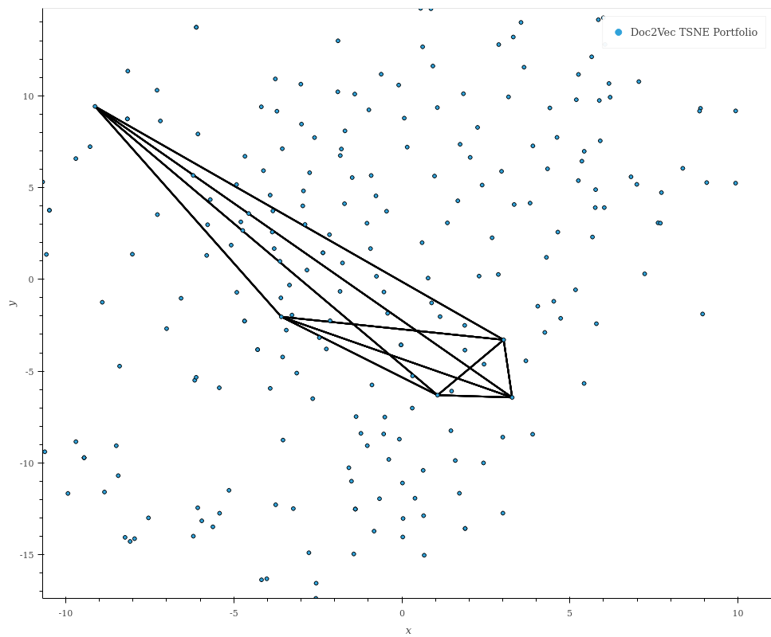
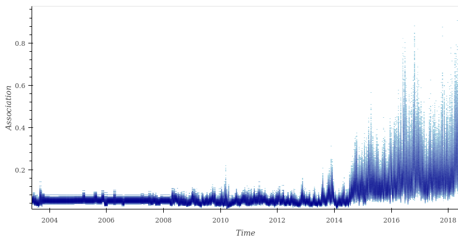
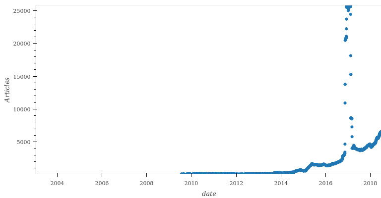
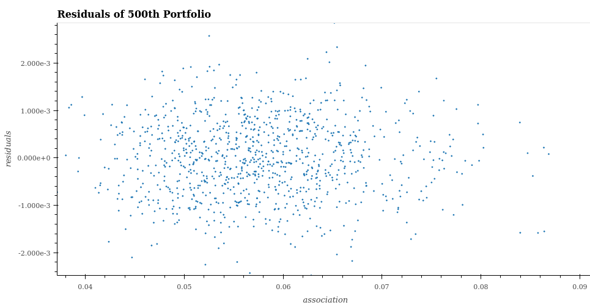
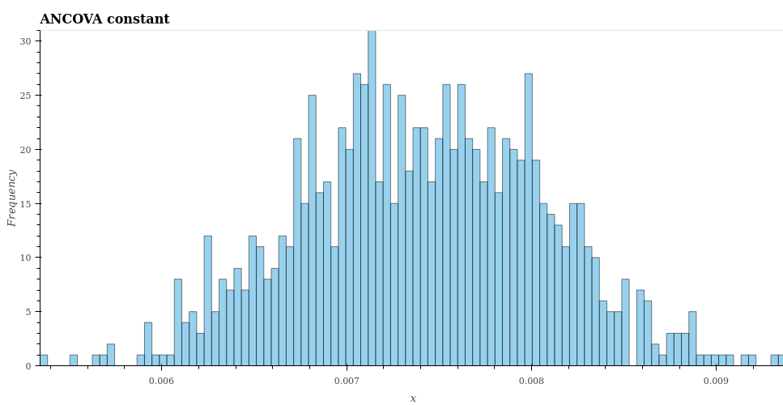
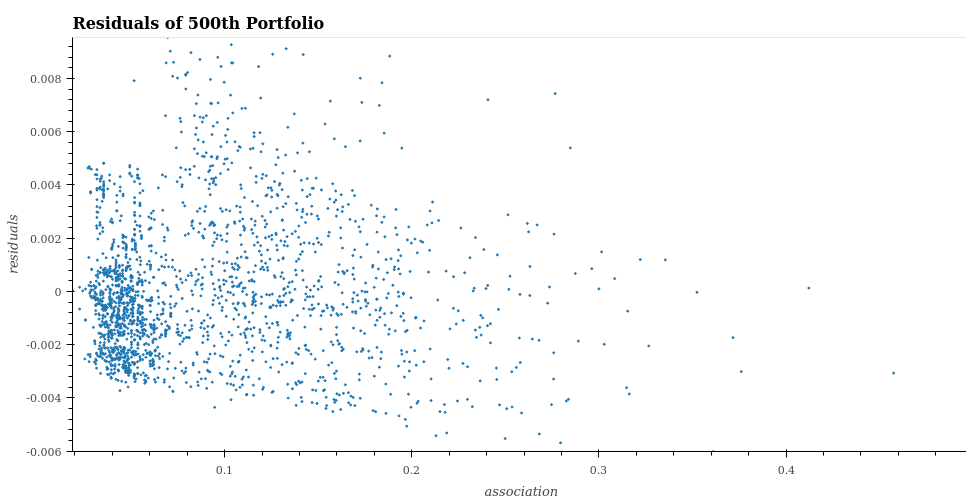
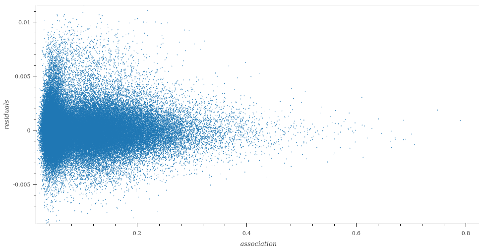
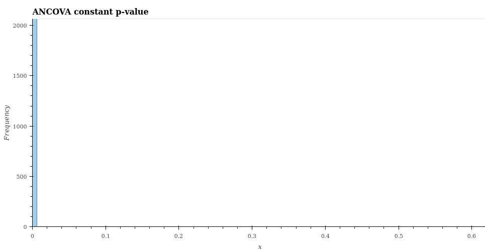

---
title: "Association-Risk: An Alternative Use for Natural Language Processing on the Johannesburg Stock Exchange (JSE)"

author:
- Robert Brink
- Marcus Gawronsky
- Christpher Kleyweg
- Ryan Kruger

date: 19 September 2018

abstract: A recent topic of interest in the realm of financial research has been the use of Artificial Intelligence (AI) in financial prediction. This paper explores the use of various techniques in the realm of Natural Language Processing (NLP), using a popular computational technique in deriving meaning from text data, to analyze the relationship between company association and portfolio diversification for companies on the Johannesburg Stock Exchange (JSE). Using a novel take on the Word2Vec word embedding technique, we show word-vector association between companies to track portfolio volatility over time. 

---  
\newpage
# Introduction  
  
With the ever-increasing availability of qualitative financial information in the form of news articles, blog posts, message boards and financially based social networks investors are no longer able to efficiently monitor and process massive amounts of unstructured data [@Tirunillai2012]. @Engelberg2008 observes that whilst some financial information is still quickly incorporated into markets due to its ease of understanding, investors tend to under-react to new information that may be more ambiguous or costly to process. As a result, a central focus of Natural Language Processing in the financial domain thus far has been sentiment analysis, providing hedge fund managers with a tool in efficiently processing information and hence the ability to profit on potential market inefficiencies. [@Engelberg2008]. In practice however, using sentiment analysis to predict stock prices has shown limited success as ambiguity and implicitly expressed sentiment remain challenging for computer algorithms to interpret. While Natural Language Processing (NLP) tools may not be exceptionally accurate at predicting sentiment, they are extremely good at making associations between words and their contexts in text data. Therefore, this paper presents an alternative use case of NLP in predicting association risk of companies within a portfolio on the Johannesburg Stock Exchange (JSE). 
  

A widely debated topic in the field of financial research concerns the measurement of financial risk. The Capital Asset Pricing Model (CAPM) remains at the core of modern financial theory some 50 years after its initial development by providing investors with a framework in determining how the expected return of an investment is affected by its risk. Central to the CAPM model is the assumption of efficient markets, whereby investors are able to fully diversify away non-systematic risk leaving systematic risk, represented by Beta, as the sole risk determinant in calculating returns [@Strugnell2015]. Given markets are shown not to be efficient in practice, we can conclude that non-systematic risk is in fact a determinant of market returns. This is supported by existing literature identifying non-systematic anomalies such as the size effect [@Banz1981] and value effect [@Basu1983], both of which are shown to have reliable predictive power in explaining returns.  Sources of non-systematic risk can be difficult to quantify, but may relate to the extent to which a portfolio is diversified.  While investors may choose to diversify across a number of metrics present in the literature such as size, value or leverage, the degree of  association between companies remains a critical metric reliant on analyst insights.  Association can come from companies sharing similar industries, sentiment, status, position in analyst insight or subsidiary relationship.  One challenge is how to both extract and quantify these measures in a way that is both unbiased, scalable and computationally tractable.  We propose a method, using dynamic document-vectors learned from a corpus derived from a 30-day news cycles in order to quantify the association between companies in a portfolio.  
  
This paper suggests an alternative risk metric to Beta known as “association risk” which measures the amount of association between companies within a portfolio and hence its associated level of diversification. This is achieved through the use sentiment analysis to form rich vector representations of companies. Portfolios are then formed at random using the sum of the distances between the companies in vector space. Portfolios of greater sum distances imply less association between companies and hence greater portfolio diversification. This paper shows that portfolios with greater level of diversification exhibit lower levels of volatility and therefore lower levels of risk.
  
$$\text{Association}=(\sum_{i=1}^{p} \sum_{j=1}^{p} \text{similarity}_{i,j})^{-1}$$
  
$$\text{similarity}_{i,j} = \cos(\theta) = {\mathbf{C}_{i} \cdot \mathbf{C}_{j} \over \|\mathbf{C}_{i}\| \|\mathbf{C}_{j}\|} = \frac{ \sum\limits_{k=1}^{n}{C_{i,k}  C_{j,k}} }{ \sqrt{\sum\limits_{k=1}^{n}{C_{i,k}^2}}  \sqrt{\sum\limits_{k=1}^{n}{C_{j,k}^2}} }$$

Association is calculated as the inverse of the sum of the cosine distances between all document vectors calculated from a given news window at some point in time.  In the equation above $p$ represents the size the a given portfolio, $C$ represent a given document vector representing a company and $k$ represents the $k$ 'th element of a vector. 
  
This paper is organised as follows. Section 2 reviews the literature on Natural Language Processing. Section 3 details the data, exploratory analysis and method. In the exploratory analysis, this paper compares four different techniques in drawing association between companies on the JSE, namely LDA, LSI, Word2Vec and Doc2Vec. Section 4 contains the results of this study and is split into three main sections being Date ANCOVA, Portfolio ANCOVA and Blocking ANCOVA, presenting our findings in a detailed discussion. Finally in Section 5, we summarise and conclude our findings.
  
              
# Literature Review   
  
The realm of Natural Language Processing has seen increased application in recent years with the growth of new techniques, datasets and computing capacity [@Sohangir2018, @OLeary2009, @Cortis2017]. In English, different words and phrases can share or have different meanings.  A key challenge of NLP comes in how to group these words and phrases in a way which is automated and efficient.  
  
Bag-of-Words (BOW) is one of the earliest iterations of NLP and while it has many drawbacks [@Harris1954], it does produce document vectors which capture the common meaning of documents sharing the same words. One disadvantage in the non-parametric Bag-of-Words technique is that it does not weight words based on their distinctiveness in the corpus of documents.  Articles like _'a'_ or _'the'_ occur throughout all English text, but contribute little meaning to a given sentence.  While much work has been done analysing the information in a given piece of text [@Shannon1951], term-frequency re-weighting has been a common staple with the Bag-of-Words approach to document vectorization [@SparckJones1972, @Robertson2004]. While this technique can increase the sparsity of a given document vector, it can improve the performance of document similarity measures, valuable in topic analysis and document clustering [@Huang2008].  
  
Unsupervised techniques for dimensionality reduction have been popular extensions on the Bag-of-Words approach. Papers by @Dumais1988 and @Deerwester1990, through a technique called Latent Semantic Indexing (LSI), compare the use of Factor Analysis (FA), Principal Component Analysis (PCA) and Multidimensional Scaling (MDS) on count vectors. A generative approach by @Blei2003, referred to as Latent Dirichlet Allocation (LDA), uses a three-level hierarchical Bayesian model to extract document vectors from a given corpus. This technique can be computationally challenging but has become a staple in many online applications. While LSI and LDA have demonstrated significant improvements to document vectorization or embedding, works by @Shannon1951 and @Huang1993 seem to indicate that a word’s meaning can be derived from the contexts it and other words find themselves in rather than just their frequency [@Baroni2014].  These contexts, known as skip-grams, refer to a sequence of words surrounding a target word. 
  
In a paper by @Bengio2003, a feed-forward neural network is used with one hidden layer to predict a word's skip-gram [@Alexandrescu2006].  Using the output of this hidden layer, @Bengio2003 demonstrate the value of this approach in extracting rich word-vectors which accurately capture the semantic meaning of words in a continuous vector space.  While this technique remains tractable on small datasets and dictionaries, a breakthrough came with @Mikolov2013a and @Mikolov2013b who used negative sampling on words' skip-grams as a tool to re-parameterize the model into something more computationally tractable [@Goldberg2014].  This technique has been extended by @Quoc2014 in a method commonly referred to as Doc2Vec, which aims to find documents representations by using the same negative sample technique discussed by @Mikolov2013b.  
  
Word2Vec, introduced by @Mikolov2013a, is seen to be a very popular technique across Machine Learning Methodologies for its ability to create state-of-the-art word embeddings. Word2Vec is a neural network method used to produce high-dimensional vector representations of each word or document in a vector space. Locations of the words relevant to each other in the vector space determine the semantic relationships between the words and Word2Vec is able to capture sentiment based similarity between words. Word2Vec can be implemented using Continuous Bag-of-Words (CBOW)  and skip-gram approaches. In the original study the quality of vector representations was evaluated using an analogical reasoning task [@Mikolov2013a]. This used five types of semantic language questions and nine types of syntactic questions. The questions were created firstly by manually pairing lists of similar words and thereafter questions were created by connecting two pairs. For example, a list of 68 American cities and the states they belong to was made. The question was correctly answered if the closest word to the vector computed is the same as the question. Questions were correctly answered with an accuracy of around 60% [@Mikolov2013a]. In a follow-up study using the same analogical reasoning task [@Mikolov2013a], @Mikolov2013b used the skip-gram model accompanied by various new efficiency techniques such as negative sampling, hierarchical softmax and the subsampling of frequent words which markedly improved results with an accuracy of 72%. 
  
Whilst Word2Vec has shown success in these  applications [@Mikolov2013a, @Mikolov2013b], its use in the prediction of both sentiment and stock price has shown limited success [@Quoc2014, @Cortis2017, @Sohangir2018]. While many explanations may exist for these findings, one primary reason can be drawn from the technique itself;  while negative sampling methods do provide semantically meaningful word embeddings in a high dimensional vector space, there exists no surety that some function exists to map these word vectors to some sentiment domain, given that these embeddings are trained on context rather than sentiment. Additionally, parsing is an issue when sentiments associated with words becomes too rich, forming knots.
  
With the growing complexity of quantitative techniques in price prediction , there remains a growing need for portfolio validation using non-market data. With the rise of ‘black box’ style models such as neural networks and random forests, this validation remains increasingly important as these models exhibit potential problems such as overfitting, reduced transparency and biased results based on poor sample data [@Glowacki2017].  
  
The problem with association-based metrics has been the difficulty of extracting association from large data sets of news and research reports as many techniques that try to compute association do not scale to large corpora. Word2Vec scales on text data thanks to its feed-forward neural network re-parameterization and use of skip-grams, we propose a technique which derives an association based portfolio risk metric using unstructured data, using both news articles and analyst reports.
  
  
# Data, Exploratory Analysis and Method  
## Data  
  
This paper uses news articles obtained from multiple online sources, as shown in Table 1. These websites were scraped for articles containing a predefined dictionary of company names from the Johannesburg Stock Exchange (JSE).  Articles were scraped as at 12 July 2018, using the Scrapy html parsing library and stored in comma separated files.  The articles were then grouped by day, before being grouped into sets of 30-day news cycles, ensuring the proper alignment of calendar days against trading days.  
  
Total Index Return was used in this study as a robust measure of price in order to account for the effect of dividend payments. Price data was sourced using the Reuters Datastream Service from companies on the JSE between 16 May 2003 and 17 May 2018.  A total of 82 of the 174 JSE stocks were used due to the volume of articles for particular companies and access to realiable descriptions. 
  
## Exploratory Analysis    
  

A number of techniques remain popular within the literature of NLP. These include LDA, LSI, Doc2Vec and Word2Vec amongst others. In the following section we analyze these four techniques and aim to visualize their data in order to assess their power in drawing association between companies on the JSE, as shown in the appendixes. 
  
Models are first trained on a fixed dataset of company descriptions. Document vectors are then computed using these various models representing each company. Two techniques were used in order to visualize these 100-dimensional document vectors, namely t-distributed Stochastic Neighbour Embedding (t-SNE), a popular manifold embedding technique, and Scaling by Majorizing a Complicated Function (SMACOF), a self organizing map technique which uses a stress measure in order to create a lower dimensional representation of data which maintains the distances between document vectors. Word2Vec is computed using cosine distances and Doc2Vec, LSI and LDA are computed using Euclidean distances.
   
One challenge in interpreting techniques is in benchmarking adequate tools for dimensionality reduction in order to visualize our 100-dimensional document vectors.  This dimensionality reduction results in some of the relationships between vectors being lost.  For t-SNE, document vectors are most accurate in their immediate neighbourhood due to the distributional assumption of the technique.  
  
In Figure 1 a scatter plot is produced for all companies in our corpus with random sampling of labels to aid in interpretation.  If we analyze the diagram, we see that telecommunications companies like Vodacom and MTN grouped together, as well as mining companies like Gold Fields and Glencore.  A number of the insurance, property and finance companies are also close in proximity.  While many of the relationships in the diagram are not easily explainable, given the size of the dataset used, it is challenging for a reliable word-vector model to be estimated without the use of techniques such as transfer-learning.  
  
  
[Figure 1]: <> (
__Figure 1: Word2vec t-SNE__
)
  
  
  
  
  
  
  
When comparing Word2Vec against other techniques we see striking differences. The first of which is that in techniques like LSI, we see far stronger clustering of companies with similar names or similar attributes or description. This is largely attributable to the underlying methodology in which a Bag-of-Words is reduced to its dimensionality using some form of Principal Component Analysis (PCA) with little concern for polysemy. While similar limitations exist in techniques such as LDA, LDA Hierarchical Bayesian Estimation also lacks sufficient variation to distinguish strongly between companies. 

When assessing Doc2Vec we see the problem of excess noise from article words whose weighting cannot be reduced in the same way TFIDF does with Word2Vec, as term frequency–inverse document frequency (TFIDF) provides more stable and accurate word vectors is given the size of the corpus. 
  
Reasons for the use of Word2Vec over other benchmark techniques are in its ability to provide rich explanation to analysts, its strong use within the literature and its power in conjunction with many other techniques such as TFIDF in order to produce documents vectors. Word2Vec is thus used as the primary technique for the remainder of this paper.
  
  
## Method  
     
### Simplified Method  
  
Data is sourced from online news articles and grouped into 30-day news-cycles. A numeric representation for each word in each article is then computed. Using a description of each company, we take a weighted sum of each word’s numeric representation to compute numeric representations for each company. The companies are randomly assigned to 1000 random portfolios, each consisting of 15 stocks. We calculate the inverse of the sum of cosine distance between the stocks in the portfolio to measure the level of similarity between each company. These distances are then summed for each portfolio to calculate a measure of similarity between all companies in a portfolio, which we call association.  This metric of association is then used as a measure of portfolio diversification and compared to the volatility of the portfolio over the the next 30 days.
  
### Use of Portfolios vs Single Stocks  
  
We are using portfolios to analyse risk rather than single stocks for two reasons. Firstly, risk is reduced in a portfolio by diversifying the types of assets in the portfolio. The associations made in our model effectively group stocks by sector. Different sectors have differing correlations to the market and building portfolios from these grouped sectors diversifies the portfolio. Secondly, CAPM assumes that Beta holds only within the context of a well diversified portfolio, but identifying the diversification of a portfolio remains a complicated task which no single metric can fully explain and often relies on an analysts understanding of companies and business and their role in the underlying economy. Our metric of association aims to quantify these firm specific attributes to quantify the diversification of a portfolio. 
  

### Data Preprocessing   
  
|             | __Python Computation__ |                        |  
|:-----------:|:----------------------:|:----------------------:|  
|   Software  |     Python 3.6         | Random seed of 42      |  
| Computation |    Dask Library        | 15 cores, 15 nodes and | 
|             |                        | 30 gigabytes per node  |  
  
Articles were preprocessed by standardizing the text to unicode characters, before transforming the text into lower-case and removing all punctuation and numeric characters.  The articles were also preprocessed to remove common stop words in this step.  These stopwords were sourced from the common Scikit-Learn library and included words like “the’’, “their”, “then” and “a”, among others.  A full list of packages versions is provided in the appendix.  
  
  
### Model Development      
The groups of articles were joined with company descriptions and used to train a series of Word2Vec models to compute word embeddings on each trading day.  We used CBOW Word2Vec model which was fitted over 30 iterations, using a random seed of 1, a learning rate of 0.025 and a window of 5.  
  
Given these embeddings, this study makes use of metadata tags of companies to address the challenge of creating vector representations of companies. For example, companies like “AngloGold Ashanti” are tagged to concepts such as “Mining” in order to ensure robust risk estimation of thinly cited companies with few mentions in a given news cycle.  Company descriptions were sourced from Bloomberg for use as tags, given the wide use and reliability of this service.  Using word vectors for each word in a tag computed from our trained models, TFIDF was used to compute a weighted average of company descriptions. 1000 random evenly weighted portfolios were drawn, each with 15 stocks and used to benchmark against a portfolios forward-looking 30-day volatility. Backtesting was done on a continuous rolling basis.  
    
One limitation in this study is that these descriptions remain unchanged over time, while descriptions of companies may have changed during this time.  This may skew the result of this research over certain time period, where companies have radically changed the nature of their core operations or where these descriptions are inaccurate.   
    
Using these vector-representations of companies, a cosine distance metric is used measuring the sum distance between companies within the portfolio in vector space in order to determine a portfolio risk metric based on the level of association between them.  
  
Figure 2 presents a t-SNE manifold embedding of the cosine distances between our different company document vectors. A portfolio of 5 different companies was chosen for illustrative purposes. From this diagram we can see the edges between nodes representing the distances between different points in our portfolio. We expect that portfolios with longer edges to be more dissimilar and thus to have greater diversification based on their firm-specific attributes.  
  
  
[Figure 2]: <> (
__Figure 2: Association Computation Diagram__
)
  
    
      
Our experimental design makes use of Analysis of Covariance (ANCOVA) in order to evaluate the relationship between association and portfolio volatility.  ANCOVA will be performed under the assumption of normally distributed errors.  ANCOVA examines the influence of an independent variable on a dependent variable while removing the effect of the covariate factor.  It assumes a linear relationship between the dependent variable and the covariate factor. Given the use of continuous testing, a time series plot of ANCOVA coefficients and p-values will be used to analyze the relationship between association and volatility.   
    
$$y_{i, j} = \mu + \tau_{i} + \beta (x_{i,j} - \bar{x}) + \epsilon_{i, j} $$  
    
  
- $Y_{i, j}$ is the covariate factor 
- $u$ is the grand mean 
- $\bar(x)$ is the global mean  
- $x_{i, j}$ is the jth observation of the jth covariate factor  
- $t_{i}$ is the variables fitted  
- $e_{i, j}$ is the error term.  
    
We analyse volume, association and volatility separately and use these insights to model using ANCOVA. When analysing variance we used ANCOVA in three different ways. Firstly, we examine variance across portfolios at a point in time which we denote as “Date ANCOVA”, secondly, the variance within a portfolio over time, “Portfolio ANCOVA” and lastly, "Blocking Ancova" where we decompose the contributions of both specific shares and exegenous showns in time to a portfolios variances. Date ANCOVA performs an ANCOVA by date over all portfolios whilst Portfolio ANCOVA performs an ANCOVA by Portfolio over all dates in time.  
    
  
__Hypothesis__
    
$$\text{H}_{0}: \beta_{1} = 0 $$  
$$\text{H}_{1}: \beta_{0} = 0 $$  
    
Where $\beta_{1}$ is a measure of association of a given portfolio at a point in time.  
    
    
# Results and discussion  
## Volume, volatility and association  
    
In analysing news volume over time it is clear that the volume of news articles scraped before 2009 is extremely low, increasing slowly up until 2014 with a rapid spike into 2018. Figure 3 details word vector associations over time. These seem to appear completely constant, before beginning to differ from 2008 onwards. This is due to the number of news articles used increasing dramatically during this period, which remains a limitation of this study. Figure 4 details the volume plot and is related to the association plot in that as news article volume increases so does the stability and accuracy of word vectors used to compute association.  
  
  
[Figure 3]: <> (
__Figure 3: Association__
  )
  
  
  
[Figure 4]: <> (
__Figure 4: News Volume__
  )
   
  
  
Volatility details the standard deviation of portfolios over time. Figure 5 shows the 300-day volatility of returns across 1000 random evenly weighted portfolios between 16 May 2003 and 17 May 2018.  When assessing volatility over time the influence of macroeconomic events such as the financial crisis in 2008 and the South African “Zuma-gate scandal” of 2016 are attributed to the spikes in portfolio volatility.  
  
  
[Figure 5]: <> (
__Figure 5: Volatility__
  )
   
  
  
## Date ANCOVA  
    
In running a test to determine whether a relationship between association and volatility exists at a singular point in time, the model is found to be insignificant. However, it is difficult to conclude from this result alone that the effect of association on portfolio diversification and volatility is entirely insignificant.  
    
Figure 6 details how our coefficients and constant in the model change across portfolios at specific points in time, referred to as “Date ANCOVA”. Data is observed between 2011 and 2018 due to the sparsity of articles captured before these dates as outlined in Figure 4. The coefficients depict an erratic motion with no real pattern or seasonality present. This may signify either the presence of some latent source of variation not captured by the model or the effects of random sampling. The coefficients are zero at many points in time violating the hypothesis for the model as coefficients equalling zero will have no effect on the model. When assessing the significance of the model across portfolios at points in time, in Figure 7, we find that our coefficient p-values are extremely large on average and that the majority of portfolios are not significant at the 5% level. This means that there is no evidence to reject the null hypothesis and we make the assumption that $\beta_{1}=0$, implying coefficients are not useful in the model.  
  
  
[Figure 6]: <> (
__Figure 6: Coefficients Across Portfolios at Points in Time__
  )
  
  
  
  
[Figure 7]: <> (
__Figure 7: Coefficent P-values Across Portfolios at Points in Time__
  )
  
  
  
    
In order to understand why these results may be insignificant we analyse the distribution of our portfolios at some random point in time. Figure 8 and Figure 9 detail results from 21/03/2015, a random date in our sample. Figure 8 and Figure 9 show no trend and exhibit a completely random and uninterpretable array of points. The results show an extremely low R-squared value of 0.004, which explains how much variation in volatility is explained by our association metric, and even though R-squared is not an exhaustive measure of model validity, it is clear to see that volatility is explained extremely poorly by association. The t-statistic for the coefficient of 2.118, used to infer if there is significant variation between the means of two groups, is low at 2.118 which is why the p-value is so high in the model even though the constant is significant and, inevitably, why the results are so insignificant. 
  
  
[Figure 8]: <> (
__Figure 8: Scatter Plot of Portfolio Association and Volatility as at 2014/03/21__
  )
  
  
  
[Figure 9]: <> (
__Figure 9: Scatter Plot of Portfolio Association and Residuals as at 2014/03/21__
  )
  
  
  
  
|                   |  __Table 2__  |                   |            |  
|-------------------|---------------|-------------------|------------|  
| Dep. Variable     | y             | R-squared         | 0.004      |  
| Method:           | Least Squares | Adj. R-squared    | 0.003      |  
| No. Observations: | 1000          | F-statistic       | 4.486      |  
| DF Residuals:     | 998           | Prob(F-statistic) | 0.0344     |  
| Df Model:         | 1             | Log-likelihood    | 5684.4     |  
| Covariance type   | non-robust    | AIC:              | -1.136e+04 |  
|                   |               | BIC:              | -1.136e+04 |  
|                   |               |                   |            |  
|                   | Coef          | std err           | t          |  
| constant          | 0.0058        | 0.000             | 32.799     |  
| X1                | 0.0064        | 0.003             | 2.118      |  
|                   |               |                   |            |  
|                   | p>\|t\|       |\[0.025            | 0.975\]    |  
| constant          | 0.000         | 0.005             | 0.006      |  
| X1                | 0.034         | 0.000             | 0.012      |  
   
  

Due to the preceding results we are inclined to believe that portfolios comprise of many sources of volatility which arise in the inclusion of a particular share with high volatility, market microstructure or a variety of other effects.  In order to further explore the relationship between association  and volatility we propose the analysis of portfolios over time, a method by which to control for these factors affecting the volatility of a specific portfolio.
  
We propose looking at ANCOVA  across time in particular portfolios, “Portfolio ANCOVA”,  which will isolate our volatility factor, in order to find a trend in the data when assessing volatility and residuals.
  
## Portfolio ANCOVA  
  
The Portfolio ANCOVA coefficients, observed in Figure 10, are reasonably uniformly distributed, are all positive and lie in a reasonable range which suggests that the model is significant.  The same can be said for the ANCOVA constant x-values which exhibit similar traits, in Figure 11. The coefficient p-value plot, in Figure 12, shows that for the majority of time periods the portfolios are significant at the 1% level with fewer portfolios significant at the the 5% level. This is sufficient evidence to reject the null hypothesis that conclude that $\beta_{1}$ is not equal to 0 which means that the coefficients will add to variation in volatility. This provides evidence that there is covariance in coefficients but does not explain the magnitude of the coefficients.
  
  
[Figure 10]: <> (
__Figure 10: Coefficients Across Time Within Portfolios__
  )
    
  
  
[Figure 11]: <> (
__Figure 11: Constants Across Time Within Portfolios__
  )
 
  
  
[Figure 12]: <> (
__Figure 12: Coefficient P-values Across Time Within Portfolios__
  )
  
  

In order to understand why these results may be significant we analyse the distribution of a portfolio over time, this being the 500th portfolio. We assess association and how it affects volatility and residuals. In these plots there is a definite trend. In Figure 13 there is a clear clustering of days where both association and volatility are low and the density of days decreases as both volatility and association increase. The residuals plot, shown in Figure 14, is similar with a large cluster at an association below 0.1 and thinning out as association increases. This suggests a positive relationship between association and volatility. With an R-squared value of 0.068, this is not much better than the previous method but it is improved which shows greater explanation of volatility by association, on average. The telling statistic is the t-statistic, which in this method is sufficiently large for the coefficient and the constant, with values of 12.279 and 72.687, making p-values significantly small. 
  
  
[Figure 13]: <> (
__Figure 13: Scatter Plot of Association and Volatility of the 500th Portfolio__
    )
  
  
  
[Figure 14]: <> (
__Figure 14: Scatter Plot of Association and Residuals of the 500th Portfolio__
   )
  
    
 \newpage   
   
|                   | __Table 3__   |                   |            |  
|-------------------|---------------|-------------------|------------|  
| Dep. Variable     | y             | R-squared         | 0.068      |  
| Method:           | Least Squares | Adj. R-squared    | 0.068      |  
| No. Observations: | 2058          | F-statistic       | 150.8      |  
| DF Residuals:     | 2056          | Prob(F-statistic) | 1.70e-33   |  
| Df Model:         | 1             | Log-likelihood    | 9334.1     |  
| Covariance type   | non-robust    | AIC:              | -1.866e+04 |  
|                   |               | BIC:              | -1.865e+04 |  
|                   |               |                   |            |  
|                   | Coef          | std err           | t          |   
| constant          | 0.0075        | 0.000             | 72.687     |  
| X1                | 0.0114        | 0.001             | 12.279     |  
|                   |               |                   |            |  
|                   | p>\|t\|       | \[0.025           | 0.975\]    |  
| constant          | 0.000         | 0.007             | 0.008      |  
| X1                | 0.000         | 0.010             | 0.013      |  
|                   |               |                   |            |  
  
## Incorporation of blocking  
  
Through an analysis of Date ANCOVA and Portfolio ANCOVA, this paper has identified that portfolios contain many sources of variation.  We suggest that the two main sources of variance to be excess systematic volatility on a given day and excess volatility of a particular share in a portfolio. We therefore propose a third method in which to control for these sources of variance using blocking.  
  
Using data on shares in our portfolios we propose a model to test for these sources of variation jointly, shown in the equation below:  
$$ y = \beta_{0} + \beta_{1} \text{Association} +  \sum_{i=1}^{t} \beta_{i} x_{i}+ \sum_{j=1}^{c} \beta_{j} x_{j} + \epsilon_{i, j}  $$  
  
Where $t$ represents a trading day in our dataset and $c$ represents the companies in a given portfolio.  
  
Given the number of data points, a stratified sample of our data was taken in order to fit this model.  The results are shown in the table below:
    

|                   |  __Table 4__     |                   |            |  
|-------------------|------------------|-------------------|------------|  
| Dep. Variable     | y                | R-squared         | 0.794      |  
| Method:           | Least Squares    | Adj. R-squared    | 0.790      |  
| No. Observations: | 123450           | F-statistic       | 182.6      |  
| DF Residuals:     | 120899           | Prob(F-statistic) | 0.000      |  
| Df Model:         | 2550             | Log-likelihood    | 6.2152e+05 |  
| Covariance type   | non-robust       | AIC:              | -1.238e+64 |  
| Date              | Mon, 17 Sep 2018 | BIC:              | -1.213e+06 |  
| Time              | 23:56:13         |                   |            |  
|                   |                  |                   |            |  
|                   | Coef             | std err           | t          |  
| Association       | 0.007            | 0.000             | 3.529      |  
| ...               |                  |                   |            |  
| Constant          | 0.0024           | 4.84e-06          | 500.510    |  
|                   |                  |                   |            |  
|                   | p>\|t\|          | \[0.025           | 0.975\]    |  
| Association       | 0.000            | 0.000             | 0.001      |  
| ...               |                  |                   |            |  
| Constant          | 0.000            | 0.002             | 0.002      |  
|                   |                  |                   |            |  
| Omnibus:          | 25356.151        | Skew:             | 0.933      |  
| Prob(Omnibus):    | 0.000            | Kurtosis:         | 7.402      |  
| Prob(JB):         | 0.000            | Cond. No.         | 1.72e+17   |  
|                   |                  |                   |            |  
| Dubin-Watson      | 1.999            |                   |            |  
| Jarque-Bera (JB): |117583.806        |                   |            |  
|                   |                  |                   |            |  
  
      
From the 120899 observations, we can observe a constant value of  0.0024 and an association coefficient of 0.0007, both significant at the 0.1% level, with t-scores of  500.510 and 3.529 respectively.  This model demonstrates a $R^2$ value of 0.794 and joint-significance of 182.6 which is significant at the 0.1% level using Fisher’s F-statistic. If we then analyze the residuals of this model, shown in Figure 15, we observe their distribution as both symmetric and distributed around 0, with little correlation to association, shown in Figure 15.  These properties are crucial to Gauss-Markov Assumptions of Ordinary Least Squares Linear Regression and the use of these estimates as an unbiased linear estimator of portfolio variance.  The p-values of our date coefficient under the null hypothesis $\beta_{t} = 0$ are both significant and insignificant at points in time, suggesting the effect of exogenous shocks to our model, shown in Figure 17.  Despite these findings, we see using blocking to control for a share’s excess volatility, demonstrating significant p-values at the 0.001% level using the student t-distribution, providing strong argument for their use in this blocking design, shown in Figure 18.  
  
  
\newpage  
[Figure 15]: <> (
__Figure 15: Histogram of Residuals for the Blocking ANCOVA__
  )
  
  
  
[Figure 16]: <> (
__Figure 16: Scatter Plot of Association and Residuals Blocking ANCOVA __
  )
    
  
  
[Figure 17]: <> (
__Figure 17: Scatter Plot of P-values for Dates of Blocking ANCOV__
  )
  
  
  
[Figure 18]: <> (
__Figure 18: Scatter Plot of P-values for Portfolios of Blocking ANCOVANCOVA__
  )
    
  
\newpage  
  
# Conclusions  
CAPM states systematic risk to be the sole risk determinant of returns, given efficient markets, where non-systematic risk is perfectly diversifiable. In reality however, markets are shown not to perfectly efficient. Given this lack of efficiency it holds that investments are subject to non-systematic risk, such as the size and value effect. This paper contributes to the existing literature, offering association risk as a portfolio specific anomaly identifying the level of diversification within a portfolio and hence its volatility in the market. 
  
The relationship between company association of shares within a portfolio on the Johannesburg Stock Exchange and portfolio volatility is confirmed by the results of this study. Firstly, Date ANCOVA produces a highly insignificant model which could not isolate association as a determinant of volatility without sufficient control of additional sources of volatility.  However, using Portfolio ANCOVA the noise is eradicated over time and association is isolated producing significant results. Whilst we are confident that covariance is not equal to zero, the extent to how much the coefficients vary make it inappropriate for use in predictive applications. Finally, using our blocking experimental design, we find a strong argument for the relationship between association and portfolio variance, when controlling for excessive systematic variance at points in time and contributions of variance by outlying high volatility shares.  
  
An opportunity for future research exists in which association risk could be used in predictive modeling and portfolio optimisation.  
  
\newpage
# Appendix  
## TF-IDF  
TF-IDF is an information retrieval technique that weighs a term’s frequency (TF) and its inverse document frequency (IDF). Each term has its respective TF and IDF score and the product of the scores is the TF-IDF weight of that term. The higher the score the rarer the term and vice versa. This score is used to assign the importance of the term throughout the the corpus. For a term t in a document d, the weight Wt,d of term t in document d is given by:  
   
$W_{t,d} = TF_{t,d} log(N/DF_{t})$
  
Where:  
- $TF_{t,d}$ is the number of occurrences of $t$ in document $d$.  
- $DF_{t}$ is the number of documents containing the term $t$.  
- $N$ is the total number of documents in the corpus.  
  

## Word2Vec  
The easiest way to think about word2Vec is that it figures out how to place words on a “chart” in such a way that their location is determined by their meaning, called a vector-space. This means that words with similar meanings will be clustered together. I.e.: Words with semantic relationships will be closer together than words without such relationships. Word2Vec is a three-layer neural network with one input, one hidden and an output layer. Word2Vec can utilize CBOW or continuous skip-gram architecture. The idea of the CBOW architecture, the Word2Vec algorithm we are using, is to learn word representations that can predict a word given its surrounding words. The input layer corresponds to signals for surrounding words and output layer correspond to signals for predicted target word. Suppose, you have an input sentence: “The cat sat on the mat”. The aim is to learn representation for words “the”, ‘’cat”, “sat” etc. To this end, the neural network tries to learn features (weights W and W') which look at words in a window, say “The cat sat” and try to predict the next word, “on”. Hence, with input as the “the”, ‘’cat”, ‘’sat”, the training process adjusts the weight of the network, so that the probability of output “on” is maximized, as compared to other words in the vocabulary. As the training procedure repeats this process over large number of sentences or phrases, the weights “stabilize”. These weights are then used as the vectorized representations of words.  
  
\newpage
## Word2Vec  

[@Mikolov2013a]  

The CBOW architecture predicts the current word based on context of a given word.  

  
  
  
This diagram outlines the vector relationship maintained through the use of word embeddings.  
king - man + woman = queen  

  
## Negative Sampling  
  
Negative-sampling is a method by which samples are drawn outside a given distribution.   In the context of Word2Vec and Doc2Vec embedding techniques, this involves sampling incorrect contexts for a given word or incorrect document tags for a given document to be used as false labels when training the embedding model.   
  
  
## Doc2Vec  
  

Doc2Vec is an adaption of Word2Vec but instead of generating relationships between words it generates relationships between paragraphs, sentences and documents. Again, there is a three-layer neural network with an input, a hidden and an output layer. The difference is that in the input layer there is now a signal for the document as well as the signals for surrounding words which is what makes the distinction between documents. The output layer, again, corresponds to signals predicting target words.  
  

## LDA   
  
Latent Dirichlet Allocation (LDA) is a generative statistical model that allows sets of observations to be explained by unobserved groups that explain why some parts of the data are similar. For example, an LDA model might have topics classified as finance-related and mining-related. Topics have probabilities of generating various words such as ore, gold, strikes which can be classified and interpreted by the viewer as mining-related. Likewise, the finance-related topic has probabilities of generating words commonly associated with finance. Words without relevance will have roughly equal probabilities. A lexical word may occur in several topics with a different probability but with a different typical set of neighbouring words in each topic. Each document is assumed to be characterized by a set of topics which makes the individual words exchangeable.  
  
##  LSI  
  
Latent Semantic Indexing (LSI)is a technique of analysing relationships between a set of documents and the terms they contain by producing a set of concepts related to the documents and terms. LSI assumes that words that are close in meaning will occur in similar pieces of text. A matrix containing word counts per paragraph is constructed from a large piece of text and a mathematical technique called Singular Value Decomposition is used to reduce the number of rows while preserving the similarity structure among columns. Words are then compared by taking the cosine of the angle between the two vectors formed by any two rows. Values close to 1 represent very similar words while values close to 0 represent very dissimilar words.   
  

## Companies in the analysis  
  
'ACL', 'AEG', 'AEL', 'AFE', 'AFX', 'AGL', 'AMS', 'ANG', 'APN', 'ARI', 'ASR', 'AVI', 'AXL', 'BAT', 'BAW', 'BGA', 'BIL', 'BVT', 'CAT', 'CLS', 'CML', 'CPI', 'DRD', 'DST', 'DSY', 'DTA', 'DTC', 'EOH', 'EXX', 'FBR', 'FSR', 'GFI', 'GND', 'HAR', 'HCI', 'IMP', 'INL', 'INP', 'IPL', 'KAP', 'LBH', 'LON', 'MMI', 'MRF', 'MRP', 'MSM', 'MTN', 'MUR', 'NED', 'NHM', 'NPK', 'NPN', 'NTC', 'OCE', 'OML', 'OMN', 'PBG', 'PIK', 'PPC', 'PSG', 'RCL', 'REM', 'RLO', 'RMH', 'SAP', 'SBK', 'SHP', 'SLM', 'SNH', 'SNT', 'SOL', 'SPG', 'SUI', 'TBS', 'TFG', 'TKG', 'TON', 'TRE', 'TRU', 'TSH', 'WBO' and 'WHL'.    
  

\newpage
## SMACOF  
  
$$\sigma(X) = \sum_{i<j<n} w_{i,j} (d_{i,j}(X)-\delta_{i,j})^2$$
  
SMACOF uses an algorithm called majorizing to minimise stress functions. Strictly speaking majorization is not an algorithm but rather an approach to constructing optimization algorithms. The principle of majorization is to construct a surrogate function which majorizes/minimizes a particular function. In some optimizations problems, the objective-function is just too complicated to evaluate directly at every iteration. Surrogate functions are constructed to mimic most of the properties of the true objective-function, but that is much simpler analytically and/or computationally.   
  
t-SNE  
  
t-ditribution stochastic neighbour embedding (t-SNE) 
  

t-SNE  is a tool to visualize high-dimensional data. It converts similarities between data points to joint probabilities and tries to minimize the Kullback-Leibler divergence between the joint probabilities of the low-dimensional embedding and the high-dimensional data. t-SNE has a cost function that is not convex, i.e. with different initializations we can get different results.  
  

\newpage
# Graphs  
  
## Exploratory Data Analysis Plots  
  
  
  
  
  
  
  
  
  
  
  
  
  
  
  
  
\newpage

# References
